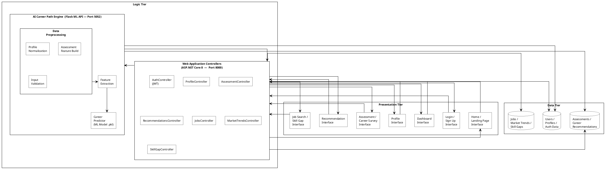

# Architecture Design Diagram — AI Career Path Recommendation System

Paste the code below into [PlantUML Online Editor](https://www.plantuml.com/plantuml/uml/) to render the diagram.

---

```plantuml
@startuml
skinparam shadowing false
skinparam backgroundColor #FFFFFF
skinparam defaultFontName Arial
skinparam defaultFontSize 11
skinparam linetype ortho

skinparam rectangle {
  BackgroundColor #FFFFFF
  BorderColor     #000000
  FontColor       #000000
  RoundCorner     0
}
skinparam database {
  BackgroundColor #FFFFFF
  BorderColor     #000000
  FontColor       #000000
}
skinparam arrow {
  Color     #000000
  FontColor #000000
  FontSize  9
}

' ╔══════════════════════════════════════════════════════╗
' ║               PRESENTATION TIER                      ║
' ╚══════════════════════════════════════════════════════╝
rectangle "Presentation Tier" as PT {
  together {
    rectangle "Home /\nLanding Page\nInterface" as UI1
    rectangle "Login /\nSign Up\nInterface"      as UI2
    rectangle "Dashboard\nInterface"             as UI3
    rectangle "Profile\nInterface"               as UI4
    rectangle "Assessment /\nCareer Survey\nInterface" as UI5
    rectangle "Recommendation\nInterface"        as UI6
    rectangle "Job Search /\nSkill Gap\nInterface" as UI7
  }
}

' ╔══════════════════════════════════════════════════════╗
' ║                  LOGIC TIER                          ║
' ╚══════════════════════════════════════════════════════╝
rectangle "Logic Tier" as LT {

  rectangle "AI Career Path Engine  (Flask ML API — Port 5052)" as Engine {

    rectangle "Data\nPreprocessing" as DP {
      rectangle "Profile\nNormalization" as N
      rectangle "Assessment\nFeature Build"  as A
      rectangle "Input\nValidation"          as V
    }

    rectangle "Feature\nExtraction"         as FE
    rectangle "Career\nPredictor\n(ML Model .pkl)" as CP

  }

  rectangle "Web Application Controllers\n(ASP.NET Core 8  —  Port 8000)" as WAC {
    rectangle "AuthController\n(JWT)"          as C1
    rectangle "ProfileController"              as C2
    rectangle "AssessmentController"           as C3
    rectangle "RecommendationsController"      as C4
    rectangle "JobsController"                 as C5
    rectangle "MarketTrendsController"         as C6
    rectangle "SkillGapController"             as C7
  }

}

' ╔══════════════════════════════════════════════════════╗
' ║                   DATA TIER                          ║
' ╚══════════════════════════════════════════════════════╝
rectangle "Data Tier" as DT {
  database "Users /\nProfiles /\nAuth Data" as DB1
  database "Assessments /\nCareer\nRecommendations" as DB2
  database "Jobs /\nMarket Trends /\nSkill Gaps" as DB3
}

' ── Presentation → Controllers ───────────────────────────
UI1 --> WAC
UI2 --> WAC
UI3 --> WAC
UI4 --> WAC
UI5 --> WAC
UI6 --> WAC
UI7 --> WAC

WAC --> UI1
WAC --> UI2
WAC --> UI3
WAC --> UI4
WAC --> UI5
WAC --> UI6
WAC --> UI7

' ── Controllers ↔ AI Engine ──────────────────────────────
WAC    --> Engine
Engine --> WAC

' ── Data Preprocessing → Feature Extraction → Predictor ──
DP --> FE
FE --> CP

' ── Engine / Controllers → Databases ─────────────────────
Engine --> DB1
Engine --> DB2
WAC    --> DB1
WAC    --> DB2
WAC    --> DB3

@enduml
```
