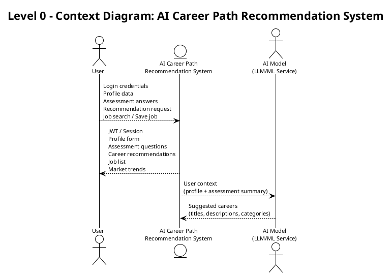
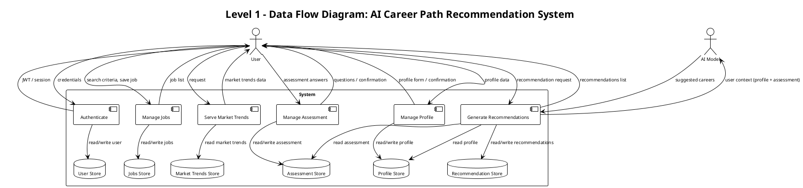
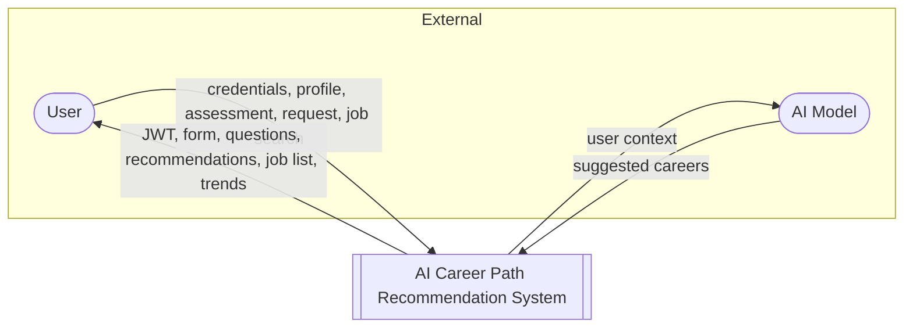
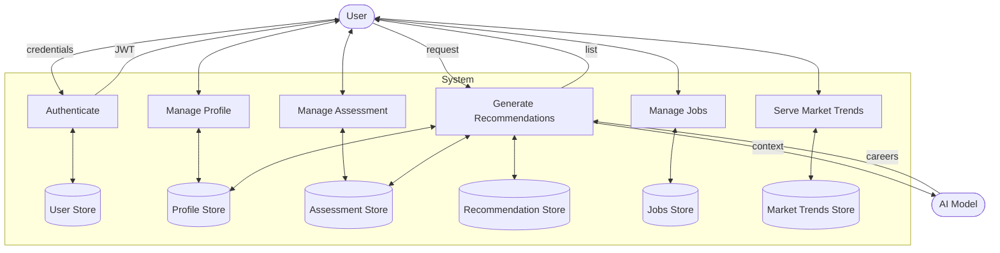

# Prompt: Create DFD (Data Flow Diagram) — AI Career Path Recommendation System

Use this prompt with an AI (e.g. ChatGPT, Claude) or a diagram tool (e.g. PlantUML, Mermaid, draw.io) to generate **Data Flow Diagrams (DFD)** for the AI Career Path Recommendation System. You can paste the prompt and get back diagram code (e.g. PlantUML) or a textual description to draw in a tool.

**DFD levels:** Level 0 (context diagram) = one process + external entities + flows. Level 1 = main processes, data stores, and flows inside the system.

---

## Quick reference: DFD elements

| Element        | Notation (typical)     | In this system |
|----------------|------------------------|----------------|
| **External entity** | Rectangle or stick figure (source/sink of data) | User, AI Model (external service) |
| **Process**    | Rounded rectangle or circle | Auth, Profile, Assessment, Recommendations, Jobs, Market Trends |
| **Data store** | Open rectangle or two parallel lines | User DB, Profile Store, Assessment Store, Recommendations, Jobs, Market Trends |
| **Data flow**  | Labeled arrow                          | credentials, JWT, profile data, assessment answers, career list, etc. |

---

## Combined prompt (Level 0 + Level 1 DFD)

Copy the prompt below to generate **Level 0 (context)** and **Level 1** DFDs. Ask for output in **PlantUML**, **Mermaid**, or **draw.io-style description**.

```
Generate Data Flow Diagrams (DFD) for the "AI Career Path Recommendation System".

SYSTEM OVERVIEW:
- Front End: React SPA (browser) — user interacts via UI (login, profile, assessment, recommendations, job search, market trends).
- Back End: REST API (e.g. .NET) — handles auth (JWT), profile, assessment, recommendations, jobs, market-trends; calls an external AI/LLM service for career recommendations; reads/writes database.
- AI Model: External LLM/ML service — receives user context (profile + assessment), returns suggested careers. No direct access to DB or Front End.
- Database: Stores User, UserProfile, Assessment, CareerRecommendation, SavedJob, MarketTrend.

LEVEL 0 (CONTEXT DIAGRAM):
- One process: "AI Career Path Recommendation System" (center).
- External entities: "User" (left), optionally "AI Model" (right) if you treat it as external.
- Data flows (label each arrow):
  - User → System: Login credentials, Profile data, Assessment answers, Recommendation request, Job search criteria, Save job/recommendation actions.
  - System → User: JWT/session, Profile form, Assessment questions, Career recommendations, Job list, Market trends, Dashboard data.
  - System → AI Model: User context (profile summary + assessment summary).
  - AI Model → System: Suggested careers (titles, descriptions, categories).
- Do not show internal processes or data stores in Level 0.

LEVEL 1 DFD (FIRST DECOMPOSITION):
- External entity: User (outside boundary).
- Processes inside the system (each as one process bubble/box):
  1. Authenticate — receives credentials, issues JWT; reads/writes User store.
  2. Manage Profile — receives profile data from User, reads/writes Profile store.
  3. Manage Assessment — receives assessment answers from User, reads/writes Assessment store.
  4. Generate Recommendations — triggered by User request; reads Profile + Assessment; sends context to "AI Model" (external or subprocess); receives suggested careers; writes Recommendation store; returns list to User.
  5. Manage Jobs — receives search criteria and save actions from User; reads/writes Jobs store (and SavedJob); returns job list.
  6. Serve Market Trends — receives request from User; reads Market Trends store; returns trend data.
- Data stores (inside system): User Store, Profile Store, Assessment Store, Recommendation Store, Jobs Store, Market Trends Store.
- If you treat AI Model as external in Level 1, show one flow from "Generate Recommendations" to external entity "AI Model" (user context) and one flow back (suggested careers). Otherwise show "AI Model" as a subprocess with one input and one output.
- Data flows: label every arrow (e.g. "credentials", "JWT", "profile data", "assessment answers", "user context", "suggested careers", "recommendations list", "search criteria", "job list", "market trends").

OUTPUT:
Produce (1) a Level 0 DFD and (2) a Level 1 DFD. For each, give diagram code in PlantUML or Mermaid that can be rendered, or a clear step-by-step description for draw.io. Use standard DFD symbols: external entity = rectangle/source; process = rounded rectangle or circle; data store = open rectangle or two lines; flows = labeled arrows.
```

---

## Example "given code" — PlantUML (Level 0 context diagram)

Use this as reference or paste into [PlantUML](https://www.plantuml.com/plantuml) to render. Style is process + external entities + labeled flows (context diagram).



---

## Example "given code" — PlantUML (Level 1 DFD)

Level 1 shows main processes and data stores. Data stores are shown as `(StorageName)`; processes as `[Process Name]`; external entities as `actor` or `entity`.



*Note: In PlantUML, `database` is used for data stores. The outer `rectangle "System"` groups processes and stores; external entities User and AI Model are outside. If your renderer has trouble with the rectangle, remove it and keep the processes and flows.*

---

## Example "given code" — Mermaid (Level 0)

Mermaid does not have a dedicated DFD syntax; this uses a flowchart style to show context-level flows.



---

## Mermaid Level 1 (simplified)



---

## Short prompt (code-only request)

If you only want diagram code in the same style as your sequence diagram, use:

```
Generate a Data Flow Diagram (DFD) for the "AI Career Path Recommendation System" in PlantUML format.

Include:
- Level 0: One central process "AI Career Path Recommendation System"; external entities User and AI Model; labeled data flows between them (credentials, profile, assessment, recommendations, user context, suggested careers, etc.).
- Level 1: Processes — Authenticate, Manage Profile, Manage Assessment, Generate Recommendations, Manage Jobs, Serve Market Trends; data stores — User, Profile, Assessment, Recommendation, Jobs, Market Trends; external — User, AI Model. Label every arrow.

Use @startuml / @enduml and standard shapes: actor/entity for external, rectangle for process, database or (Store) for data stores. Same style as a context + level 1 DFD.
```

---

## Quick reference: main data flows

| From → To           | Data flow label(s) |
|---------------------|--------------------|
| User → System       | Login credentials, profile data, assessment answers, recommendation request, job search criteria, save job/recommendation |
| System → User       | JWT/session, profile form, assessment questions, career recommendations, job list, market trends |
| System → AI Model   | User context (profile summary + assessment summary) |
| AI Model → System   | Suggested careers (titles, descriptions, categories) |
| Processes ↔ Stores  | read/write per entity (User, Profile, Assessment, Recommendation, Jobs, MarketTrends) |

Use these prompts as-is or adapt them for your preferred tool (PlantUML, Mermaid, draw.io, Lucidchart). The "given code" blocks above can be pasted into PlantUML or Mermaid renderers to get an editable diagram.
